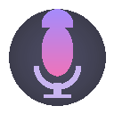

<p align="center">
  
</p>

<h1 align="center">Voice Memo Transcriber</h1>

<p align="center">
  <strong>Instantly transcribe voice memos on WhatsApp Web & Messenger — right in your browser.</strong>
</p>

<p align="center">
  <a href="LICENSE"></a>
  
  
  
  
</p>

<p align="center">
  <a href="#-quick-start">Quick Start</a> •
  <a href="#-features">Features</a> •
  <a href="#%EF%B8%8F-getting-a-groq-api-key">Get API Key</a> •
  <a href="#-how-it-works">How It Works</a> •
  <a href="#-privacy">Privacy</a>
</p>

---

## What is this?

A **free, open-source Chrome extension** that adds a "Transcript" button to every voice memo on **WhatsApp Web** and **Facebook Messenger**. One click and you get a full transcription — complete with mood detection, energy analysis, and smart formatting.

**No server needed.** Install the extension, paste your free Groq API key, and you're ready to go. That's it.

---

## 🚀 Quick Start

Getting started takes less than 2 minutes. No coding or technical knowledge needed!

### Step 1: Download the Extension

<p align="center">
  <a href="https://github.com/JSvandijk/voice-memo-transcriber/archive/refs/heads/master.zip">
    
  </a>
</p>

1. Click the **Download** button above (or [click here](https://github.com/JSvandijk/voice-memo-transcriber/archive/refs/heads/master.zip))
2. A `.zip` file will download to your computer
3. **Extract/unzip** the folder (right-click → "Extract All" on Windows, double-click on Mac)
4. Remember where you saved the extracted folder — you'll need it in the next step

### Step 2: Add it to Chrome

1. Open Google Chrome
2. Type `chrome://extensions` in the address bar and press Enter
3. In the top-right corner, flip the **"Developer mode"** toggle to ON
4. Click the **"Load unpacked"** button that appears
5. Navigate to the folder you just extracted and select it
6. The extension is now installed! You should see it in your toolbar

> **💡 Can't see the icon?** Click the puzzle piece icon 🧩 in Chrome's toolbar, then pin "Voice Memo Transcriber" so it's always visible.

### Step 3: Get Your Free API Key

The extension uses [Groq](https://groq.com) for transcription — it's **completely free** for personal use.

1. Go to **[console.groq.com/keys](https://console.groq.com/keys)**
2. Create a free account (you can sign in with your Google account)
3. Click **"Create API Key"**
4. Give it any name (e.g., "voice transcriber")
5. **Copy the key** — it looks like `gsk_abc123...`

> **ℹ️ What is Groq?** Groq is an AI company that provides free access to advanced speech-to-text models. Your voice memos are processed by their servers and immediately discarded — nothing is stored.

### Step 4: Activate the Extension

1. Click the **Voice Memo Transcriber icon** in your Chrome toolbar (the purple microphone 🎤)
2. Paste your API key into the input field
3. Click **"Save"**
4. The dot turns **green** — you're all set! ✅

### Step 5: Start Transcribing!

1. Open **[WhatsApp Web](https://web.whatsapp.com)** or **[Messenger](https://www.messenger.com)**
2. Find any voice memo in a chat
3. You'll see a **"Transcript"** button next to it
4. Click it and watch the magic happen! 🎉

---

## ✨ Features

### 🎤 One-Click Transcription
Click "Transcript" on any voice memo and get an accurate, full-text transcription in seconds. Powered by Groq's Whisper large-v3 — one of the best speech-to-text models available.

### 🌍 Works on Both Platforms
One extension, two platforms. Works seamlessly on both **WhatsApp Web** and **Facebook Messenger** — no configuration needed. It automatically detects which site you're on.

### 😄 Vibe Detection
AI-powered mood analysis reads the emotional tone of each voice message and displays it with fitting emoji. Is your friend excited? Sad? Spilling tea? You'll know at a glance.

### 📊 Energy Bars
Visual energy level indicator shows whether the message is low-key chill or high-energy excitement — displayed as a sleek animated bar.

### 🔤 Volume-Styled Text
Words are styled based on how loud they were spoken. Whispered words appear small and light, loud words appear bold and large — giving you a visual feel for how the message sounded.

### 🧹 Smart Filler Removal
Automatically cleans up filler words like "um", "uh", "like", "you know" — in both English and Dutch — so you get clean, readable text.

### 📝 TL;DR Summaries
Long voice message? Click "Summary" to get a concise 1-2 sentence summary. Perfect for those 5-minute voice memos when you're in a hurry.

### 🔒 Fully Serverless
Everything runs in your browser. No backend server, no data collection, no middleman. Your audio goes directly from your browser to Groq's API and back. Nothing is stored anywhere.

### 🌐 Multi-Language Support
Whisper automatically detects the language — works with 50+ languages out of the box. The vibe detection and summaries adapt to the detected language.

---

## 🛠️ Getting a Groq API Key

Groq provides a **generous free tier** — more than enough for personal use.

| Step | Action |
|------|--------|
| 1 | Go to [console.groq.com](https://console.groq.com/keys) |
| 2 | Sign up for free (Google, GitHub, or email) |
| 3 | Click **"Create API Key"** |
| 4 | Give it a name (e.g., "voice transcriber") |
| 5 | Copy the key — it starts with `gsk_...` |
| 6 | Paste it into the extension popup |

> **ℹ️ Note:** Your API key is stored locally in your browser's storage. It never leaves your machine except to authenticate with Groq's API.

> **⚠️ Free tier limits:** Groq's free tier allows ~14,400 audio-seconds per day. That's roughly **240 minutes of voice memos per day** — more than enough for most users.

---

## ⚙️ How It Works

```
Your Browser
│
├── interceptor.js (captures audio from the page)
│     ↓ window.postMessage
├── bridge.js (bridges browser security worlds)
│     ↓ chrome.runtime.sendMessage
├── background.js (service worker)
│     ↓ HTTPS request
└── Groq Cloud API
      ├── Whisper large-v3 → transcription
      └── Llama 3.3 70b → vibe detection + summaries
```

**The technical flow:**

1. **Audio Capture** — The extension intercepts audio playback APIs to capture voice message data when you click "Transcript"
2. **Bridge** — Audio data is passed from the page context through a secure bridge to the extension's service worker
3. **Transcription** — The service worker sends the audio to Groq's Whisper API for transcription
4. **Vibe Analysis** — The transcript is then analyzed by Llama 3.3 70b for emotional tone and energy level
5. **Display** — Results are rendered directly in the chat UI with styled text, emoji, and energy bars

---

## 🔒 Privacy

Your privacy is a core design principle:

- ✅ **No server** — everything runs locally in your browser
- ✅ **No data collection** — zero analytics, zero tracking
- ✅ **No storage** — audio is processed in real-time and never saved
- ✅ **API key stays local** — stored in Chrome's local storage only
- ✅ **Open source** — verify everything yourself

The only external communication is between your browser and Groq's API for transcription. No audio, text, or personal data is sent anywhere else.

---

## 🤝 Contributing

Contributions are welcome! Feel free to:

- 🐛 Report bugs via [Issues](../../issues)
- 💡 Suggest features via [Issues](../../issues)
- 🔧 Submit pull requests

---

## 💖 Support This Project

If this tool saves you time and you find it valuable, consider supporting its development:

<a href="https://buymeacoffee.com/jsvandijk" target="_blank">
  
</a>

Your support helps keep this project free and actively maintained!

---

## 📄 Tech Stack

| Component | Technology |
|-----------|-----------|
| Extension | Chrome Manifest V3 |
| Transcription | Groq Whisper large-v3 |
| AI Analysis | Groq Llama 3.3 70b Versatile |
| Language | Vanilla JavaScript (zero dependencies) |
| Server | None — fully serverless |

---

## 📄 License

This project is licensed under the [MIT License](LICENSE) — free to use, modify, and distribute.

---

<p align="center">
  Made with ❤️ for people who prefer reading over listening
</p>
